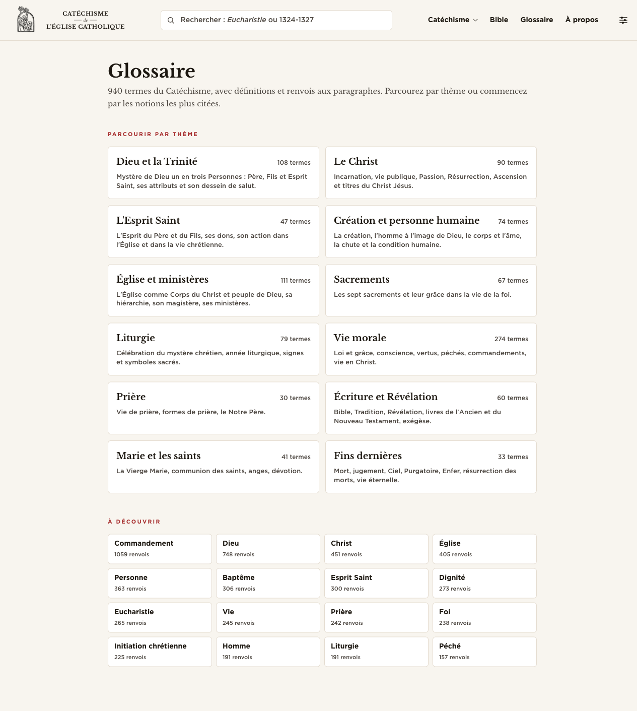
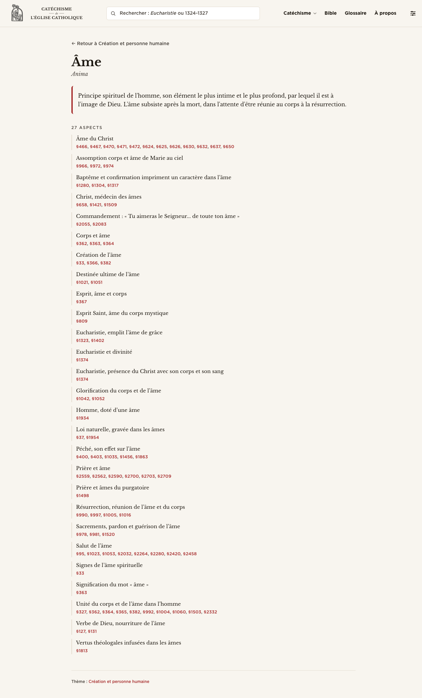
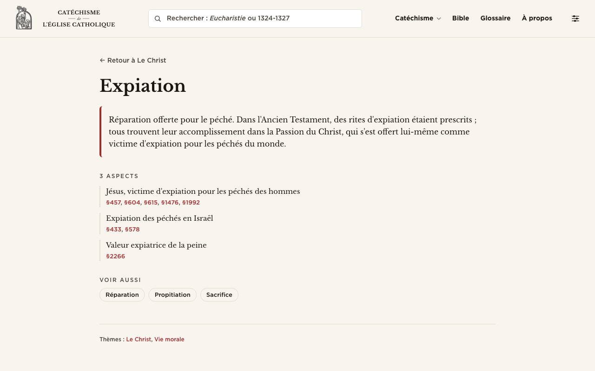
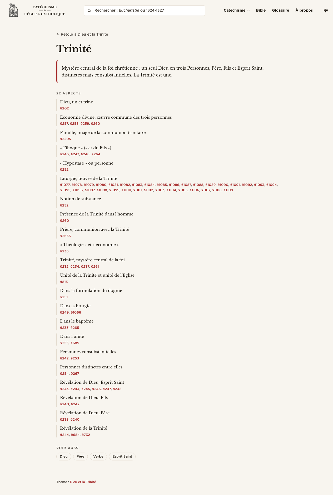
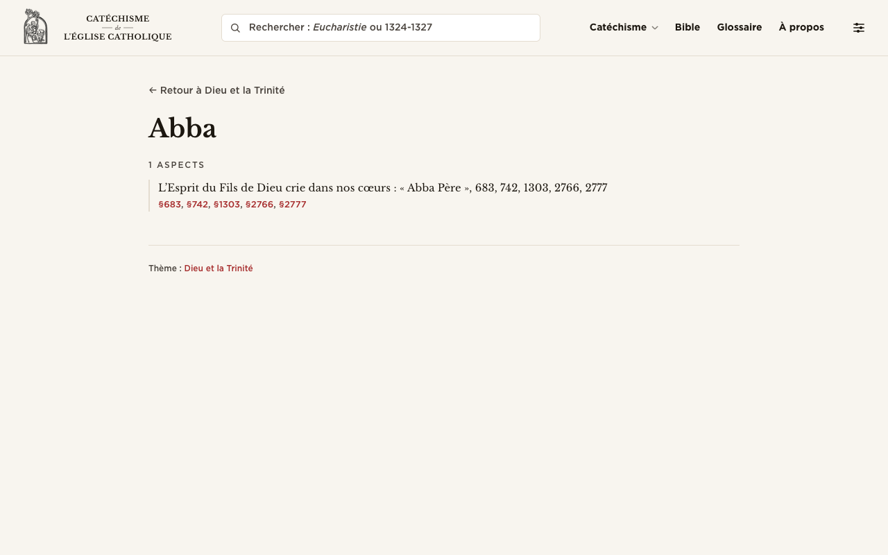
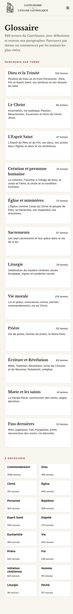
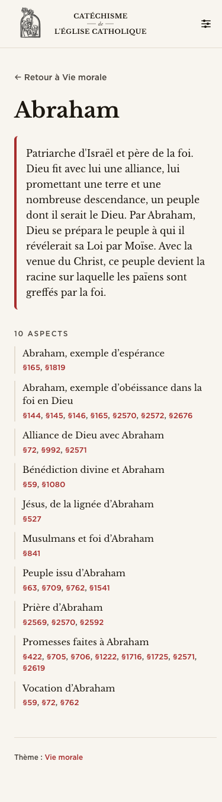

# Glossaire — design review

Date: 2026-05-05
Routes: `/glossaire`, `/glossaire/[term]`, and the secondary `/glossaire/c/[cluster]` (cluster index, encountered while reviewing).

## TL;DR

- The detail page leans on a **left-bar accent quote-box** for the definition and a **near-identical left-bar** for every subEntry. The two patterns visually rhyme, and the page reads as one long quote-block list. Demote the subEntry rule to a hairline (or drop it entirely) and let typography carry the hierarchy.
- The index page has **two stacked card grids** (12 cluster cards, then 16 "À découvrir" tiles) but no alphabetical jumper, no search affordance, and no way to reach the flat A-Z list of all 940 terms without first picking a theme. Add a single hairline alphabet bar (or top-level "tous les termes" link) so users who know the word they want aren't forced through the cluster taxonomy.
- The **paragraph references** are rendered as inline comma-separated `§N` links and pile up unflatteringly on rich entries (Trinité has a subEntry with 30+ refs on one line; Promesses faites à Abraham wraps to two lines on mobile). They want either contiguous-range collapsing (the helper `refLabel` already exists in the file but is **never called** — bug or oversight) or a more disciplined chip treatment.

## Inventory

**`/glossaire` (index).** Three blocks: page header (title + 2-line subtitle citing 940 terms / 12 themes), a 2-column responsive grid of **12 cluster cards** (label, count badge, 1-sentence description), and a 4-column responsive grid of **16 "À découvrir" tiles** (term + ref count). No search box of its own (the global header search is the only entry point), no A-Z jumper, no link to a flat all-terms view.

**`/glossaire/[term]` (detail).** Top: back-link breadcrumb (`← Retour à <cluster>` or generic `← Retour à glossaire`). Header: term as `text-4xl` Baskerville, optional Latin in muted italic body. Optional **definition** in a sepia-tinted box with a 4px accent left border. Either a flat **Renvois** list (when no subEntries), or an **N aspects** section: each subEntry is a labelled item with a 2px muted left border, the label in body type, the refs underneath as inline `§N` links. **Voir aussi** chips in pill form, only shown when at least one resolves to an existing slug. Footer aside: cluster chips as plain inline links, separated by a comma.

**`/glossaire/c/[cluster]` (cluster index, not in the brief but encountered).** Sticky alphabet jumper, A-Z grouped sections, leader-dot rows (term ............ N renvois). Genuinely good — see "what's working".

## Index page

**The two grids fight each other.** Both are bordered cards on `bg-panel`, both use the same hover state (`hover:border-accent`, `hover:bg-accent/5`), both have a count in the corner. They differ only in size and column count. The page therefore reads as "more of the same, smaller" rather than as two distinct moves (browse by theme vs. jump to a hot term). At least one of them should drop the chrome — the natural candidate is "À découvrir": 16 tiny boxes with right-aligned ref counts feel like an admin dashboard. A simple inline list, two columns, term in Baskerville body with the count in muted UI to the right (the same leader-dot pattern already used on the cluster page) would feel editorial instead of SaaS.

**Vie morale (274 termes) dominates by an order of magnitude over Prière (30) and Fins dernières (33).** Visually they all get the same card. The cluster grid would benefit from order tweaks or a count-as-bar treatment so the imbalance is honestly signalled instead of flattened.

**No alphabet skipper, no all-terms link, no on-page search.** A user who arrives knowing they want "filioque" has to either guess the cluster (Dieu et la Trinité) or use the global header search, which surfaces CCC paragraphs and Bible passages alongside glossary entries. A hairline A-Z strip across the top of the page (linking each letter to a fragment in a hidden but lazy-rendered flat list, or to a separate `/glossaire/tous` route) would unblock the power user. At minimum, a single muted ui-link "Voir tous les 940 termes" beside the subtitle.

**The "12 thèmes" section header reads `PARCOURIR PAR THÈME` in 11px accent caps.** Two of them in a row, both in the same accent caps treatment, then nothing else — so the eyebrows aren't structuring the page, they're just decorating. A single accent eyebrow on the index would be enough; the second can become a quiet `font-heading` heading in body weight, or be dropped entirely with the featured tiles becoming a ruled section under a one-line introduction.

**Top margin (`py-10`) is on the tight side.** The Bible reader and CCC pages give the page header more vertical air. The Glossaire index header (`mb-10` plus the section's `mb-12`) has rhythm internally but the whole block feels jammed up against the site header.

## Detail header (term, Latin, clusters)

**Latin treatment is correct but undercommitted.** `Anima` sits as a single italic muted body line beneath the term. That's the right register, but at 16px it's the same size as the definition prose two lines later, and visually it just looks like a stray subtitle. Two options: (1) drop the Latin to 14–15px and tighten its leading so it reads as a name-tag, OR (2) bring it onto the same line as the term, after a hairline em-space, with `latin-spec` styling — `Âme · Anima` or `Âme | Anima` — so the term and its Latin form a single editorial line. Option 2 is closer to the wordmark's hairline-rules-around-*de* pattern, and uses no extra vertical real estate.

**Cluster chips at the foot of the page (`Thème : <link>`) are the right place for them**, but the inline-comma list pattern (`Le Christ, Vie morale`) is unstyled — these are not chips, they're bare links. Compare with the **Voir aussi** section where the same kind of cross-reference IS rendered as pill chips. Pick one chip language and use it consistently. My read: the cluster chips at the foot should look like the seeAlso pills (small, hairline border, body-italic label) for consistency with the cluster-card vocabulary on the index. Bare comma-separated links there feel like a placeholder.

**No breadcrumb beyond the single back-link.** `← Retour à Le Christ` is one bidirectional move. There is no `Glossaire / Le Christ / Expiation` chain. Given the depth is only 2, that's defensible, but at minimum the back-link could be styled less like a body link and more like a true breadcrumb (a faint rule above it, smaller, eyebrow caps, and the whole path: `GLOSSAIRE · LE CHRIST`). Right now it reads as ordinary navigation copy.

## Definition prose

**The accent-tinted callout box around the definition is the loudest element on the page.** `bg-accent/5 border-l-4 border-accent rounded-md p-4` makes the two-sentence definition a quote-block. On a 1280 viewport with `max-w-reader` (~720px), the definition is the only thing in colour above the fold — it pulls focus away from the term itself. For an editorial register this should be plain prose: a small top margin, body Baskerville at 17px, no tint, no border, no rounded panel. If a separator is wanted, a single 1px hairline rule beneath the definition is enough.

**The accent-tinted box is also redundant with the subEntry left-bar pattern.** Two consecutive treatments using a vertical accent or border-l rule: the eye reads them as parallel siblings rather than as definition-then-aspects. Removing the box on the definition would also fix this rhyme.

**Line length and leading are fine** — `max-w-reader` clamps to ~64ch, `leading-relaxed` is appropriate. Don't change.

## directRefs and subEntries

**`refLabel()` is defined in the component but never called.** Lines 5–24 of `[term]/+page.svelte` build a contiguous-range collapser (`1373, 1374, 1375` → `1373-1375`), but the `{#each}` loop iterates the raw array. The Trinité entry has a subEntry "Liturgie, œuvre de la Trinité" with 33 contiguous-ish refs (§1077-§1109) rendered as 33 individual link pills on one line. With range collapsing the same data could read `§1077-1109`. This is the single highest-leverage fix on the page — implement it, or delete the dead helper.

**Refs are rendered inline, not as chips, even though they're called "renvois" everywhere else and the rest of the site uses chips.** Compare CcC paragraph chips in the StudyPanel — they're solid pills with a tabular-nums treatment. Here they're inline accent-coloured anchors with the `§` glyph. Consistency argument cuts toward chips. Counter-argument: 33 chips on one line is also ugly. Real answer: **collapse the ranges first**, then decide whether the resulting 4–6 tokens should be chips or inline anchors. With ranges, inline anchors are fine; with raw lists, chips at least give them visual breathing room.

**SubEntry left-border (`border-l-2 border-border pl-3`) competes with the definition box.** The two-sentence definition gets a 4px accent border, every subEntry gets a 2px border (muted). That's the same idiom at two intensities, so the eye sees a ladder of left-bars marching down the page. The subEntry pattern can drop the border entirely: a small bottom margin between items and a label-then-refs typographic block reads cleaner, especially on entries like Trinité where there are 22 of them.

**SubEntry label is in body Baskerville at 15px, refs at 13px UI underneath.** That hierarchy is correct (label leads, refs support) but the contrast is too gentle — at a glance the label and refs look like one paragraph. Either bump the label to 16px and bold it, or shift the refs to a smaller size + slightly more muted colour, so the label clearly leads.

**Empty `directRefs` + non-empty `subEntries`:** the directRefs branch is correctly skipped (`{#if data.entry.directRefs.length > 0 && data.entry.subEntries.length === 0}`). However when both are non-empty (which the data model permits), only subEntries render and directRefs are silently dropped. Worth checking the data: if there are entries with both, they're losing information. A quick `evaluate` on the JSON would confirm.

**The `N aspects` eyebrow is fine in plural** but reads awkwardly at `1 ASPECTS` (Abba page, one subEntry). Use `1 ASPECT` / `N ASPECTS` and `1 RENVOI` / `N RENVOIS` — French agrees in number.

## seeAlso

**The pill treatment on Voir aussi is the best chip pattern on the page** — small (13px), hairline border, hover→accent. This is what cluster chips should look like.

**Resolution logic in the loader is impressive** (4-tier match) but **silent failures are silent** — labels that don't resolve are simply dropped (`.filter((l) => l.slug)`). Consider rendering unresolved labels in a 3rd, more muted style (no border, just italic muted text) so editors can see at a glance which seeAlso targets are missing from the canonical entry list. Right now an editor has no signal that "Voir aussi" was supposed to have 5 entries and only 3 made it.

## Cluster chips

The footer "Thème : Le Christ, Vie morale" line is the weakest chip pattern on the page — it's not chips at all, it's a `font-ui text-[12px] text-muted` paragraph with comma-separated accent links inside. **Use the same pill style as Voir aussi**, smaller (11px) and without the accent text colour (clusters are already a metadata category, not a peer term), so they read as taxonomy chips rather than as related-term chips. That keeps Voir aussi visually higher in the hierarchy than Thème — which is correct.

## Sparse / empty states

**Abba (no Latin, no definition, single subEntry)** lays bare how much weight the definition box carries on richer entries. On Abba the page is: back-link, term, `1 ASPECTS` eyebrow, one subEntry line, footer. It looks anemic — and it shouldn't, because that's a perfectly legitimate kind of entry. Two suggestions: (1) when there's no definition AND only one subEntry, **inline the subEntry's refs as the page's primary content** (drop the eyebrow, drop the left-bar, just typeset the label as a body sentence with refs after it). (2) When there's no Latin and no definition, the term should sit comfortably alone — the current 4xl-then-empty pattern leaves a void where editorial weight should be.

**Side observation:** Abba's subEntry label is "L'Esprit du Fils de Dieu crie dans nos cœurs : « Abba Père », 683, 742, 1303, 2766, 2777" — the source has folded the refs into the label string, then the refs are also rendered explicitly below. The page renders both, so the user sees `, 683, 742, 1303, 2766, 2777` twice. This is a data prep issue, not a UI issue, but it's the kind of bug that's invisible on rich entries and obvious on sparse ones. Worth filing.

## Mobile

**Index mobile is fine** — cluster cards stack to one column, "À découvrir" tiles drop to two columns. Both are legible. The double-grid problem from desktop is less acute because they're at least visually different sizes.

**Detail mobile (Abraham)** — `Promesses faites à Abraham` has 8 refs that wrap to two lines on a 390 viewport. Comma-separated `§422, §705, §706, §1222, §1716, §1725, §2571, §2619` is fine when it fits, awkward when it wraps mid-list (the comma orphans). Range collapsing would fix this for free (most of those aren't contiguous though, so even with collapse there'd still be wrapping). A small `gap-x-2 gap-y-1 flex flex-wrap` treatment on the refs container with each ref as its own inline-block (or chip) would wrap more cleanly than a single inline run.

**The accent definition box on mobile** is even more dominant than on desktop because it occupies almost the full content width. Same recommendation as desktop: drop the tint and border.

**No back-to-cluster button at the bottom of long detail pages.** On a 22-aspect entry like Trinité on mobile, the user scrolls a long way down past all subEntries to the cluster chip footer; there's no "back to top" or repeated breadcrumb. The footer aside currently just says `Thème : Dieu et la Trinité` as a link. A cleaner pattern: at the foot, render the same `← Retour à <cluster>` back-link a second time. Cheap, conventional, and helpful on long entries.

## Navigation

**The back-link at the top is good but lonely.** As above, repeat at the bottom of long pages.

**The site header has a top-level `Glossaire` link** (visible in the header in every screenshot), so navigation TO the index is fine. The issue is navigation WITHIN the glossary (peer term jumping). The seeAlso pills cover same-cluster siblings; cross-cluster jumping requires going back to the cluster, then to the index, then to a different cluster — three clicks. A small "Glossaire complet (A-Z)" link in the index header (or in the detail-page footer) shortens this to one click.

**No "previous/next term" navigation on detail pages.** Probably correct — alphabetical adjacency in a glossary isn't meaningful — but consider a "Termes voisins dans <cluster>" foot strip showing 3-4 same-cluster siblings before/after this entry by ref-count or alphabetical order. Optional. Don't ship if it adds chrome without payoff.

## Page rhythm

**Index:** header (`mb-10`), cluster section (`mb-12`), featured section (`mb-12`). Even spacing — fine. The two grid sections want **more visual differentiation** (different chrome, not just different cell size), as discussed.

**Detail:** back-link `mb-6`, header `mb-6`, definition `mb-8`, subEntries `mb-8`, seeAlso `mb-8`, cluster footer `mt-12 pt-6 border-t`. The 8-margin staircase is consistent but every section is the same intensity — there's no quiet space, the eye never gets to rest. Putting 12 between major regions (header→definition is a major break; subEntries→seeAlso is a minor list-to-list transition) would help breathing.

**`max-w-reader`** (the same width as Bible chapter prose) feels just right for definition prose but slightly cramped for the 33-ref subEntry on Trinité — the inline ref list is forced to wrap because the container is narrow. With range collapsing this stops mattering. Without it, consider widening JUST the subEntry refs container.

---

## What's working — leave alone

- **The cluster page (`/glossaire/c/<id>`) is genuinely good.** Sticky alphabet bar with `top: 80px` (under the site header), letter-grouped A-Z sections with `scroll-margin-top: 140px` to anchor properly, leader-dot rows (`flex-1 border-b border-dotted border-border`) that read editorial-classical the way the rest of the site is trying to. Don't touch this — it should be the design vocabulary the index page borrows from, not the other way around.
- **Cluster card copy.** The 1-sentence descriptions are well written (catechetical, not marketing). Order of clusters (Trinité → Christ → Esprit → Création → Église → Sacrements → Liturgie → Morale → Prière → Écriture → Marie/saints → Fins) follows the Catechism's own four-pillar ordering with sensible relocations. Don't reshuffle.
- **The seeAlso resolver** with its 4-tier matching strategy is exactly the kind of editorial pragmatism the project benefits from. Keep.
- **Latin slot exists in the data model and on the page.** That's a real differentiator vs. anglophone Catholic resources. The styling is undercommitted but the data plumbing is in place.
- **Total ref-count sort for the "À découvrir" tiles** is a reasonable signal of theological centrality (Commandement 1059, Dieu 748, Christ 451). Keep the sort. Reconsider the chrome.
- **`refsCovered` and `standalone` fields exist** in the schema even if unused in the current UI — useful hooks for a later "this glossary entry covers paragraphs §X-§Y of the Catechism" surfacing.
- **The breadcrumb back-link adapts to cluster context** (`Retour à <cluster>` if the entry has a cluster, else `Retour à glossaire`). Subtle, correct.
