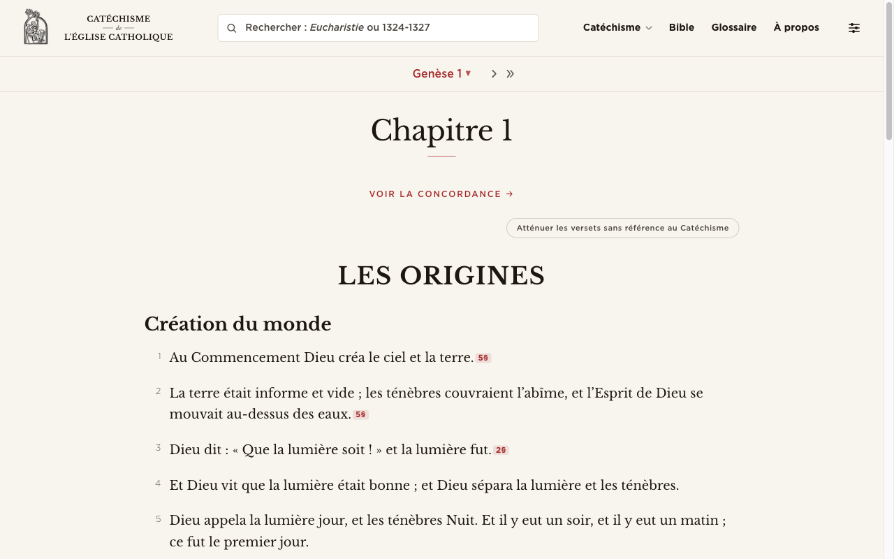
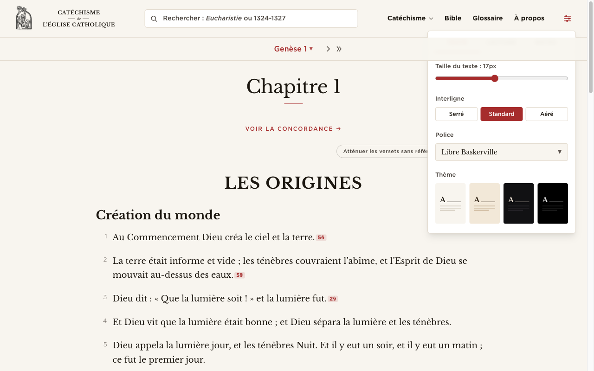
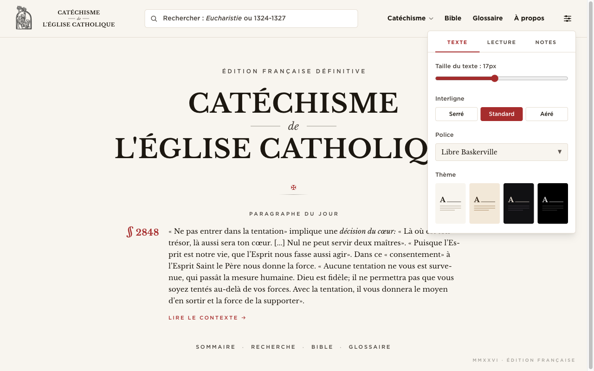
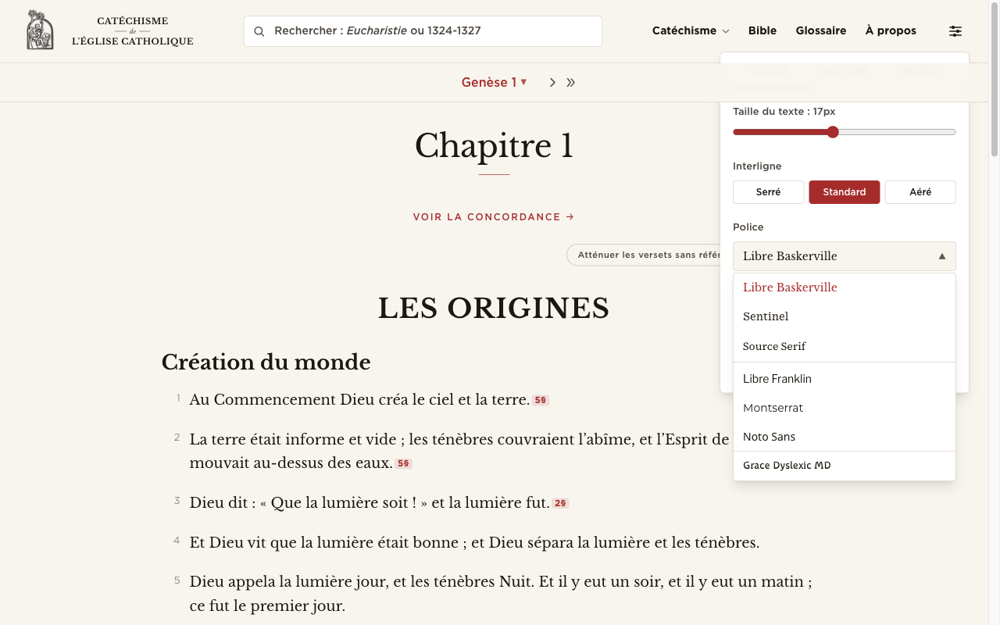
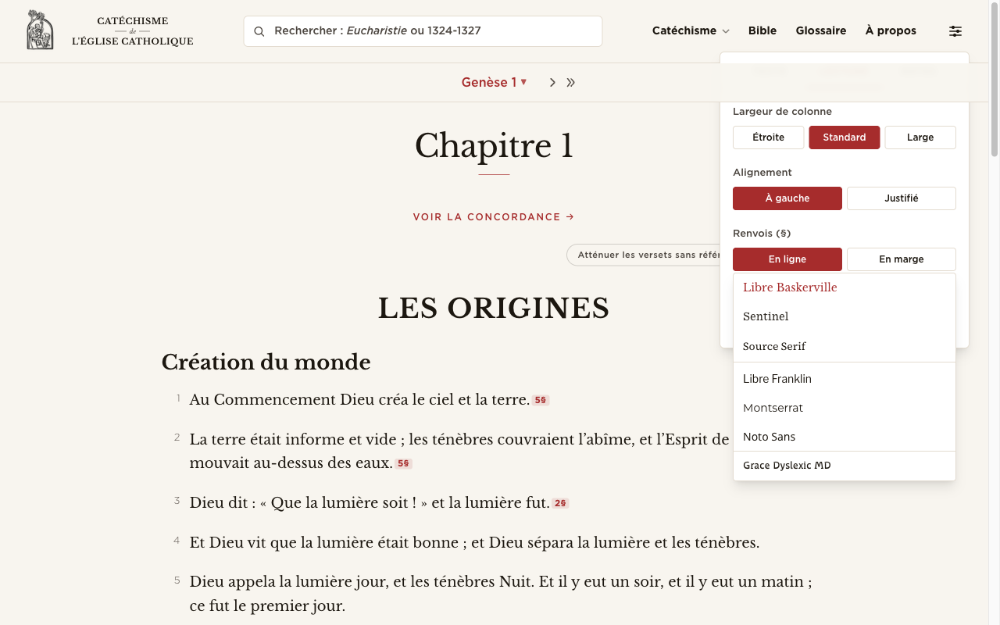
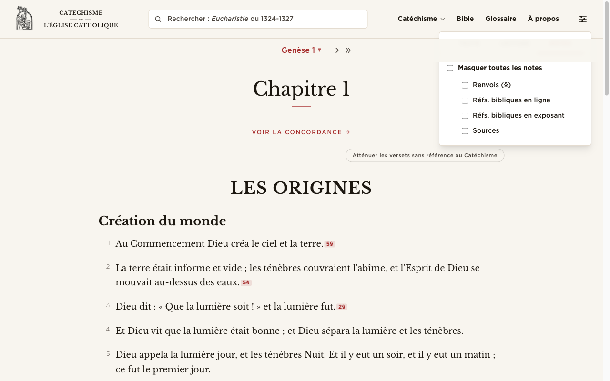
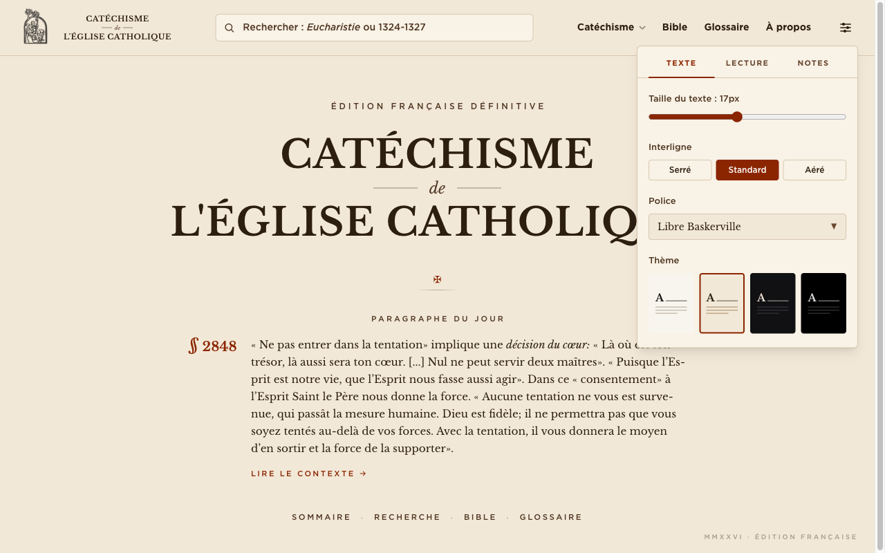
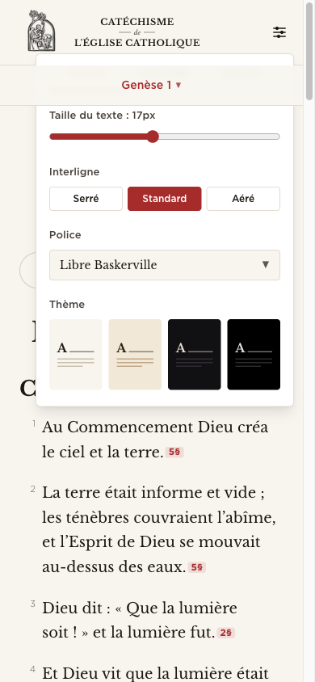
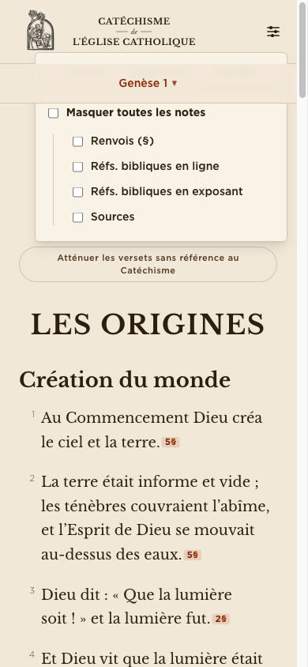
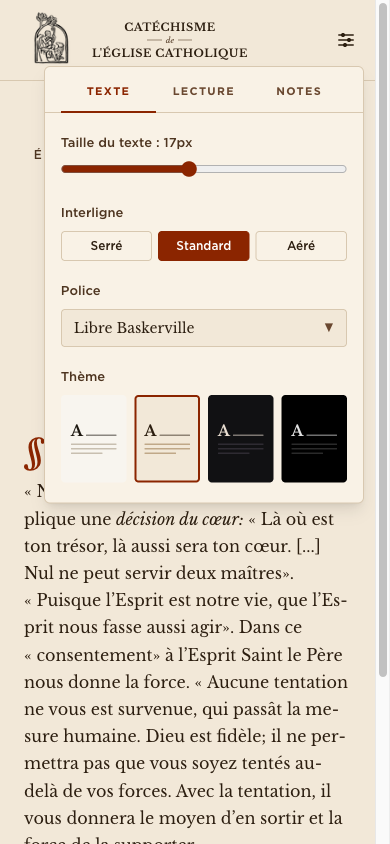

# ReadingPrefs — design review

Date: 2026-05-05
Component: `src/lib/components/ui/ReadingPrefs.svelte`
Trigger: `src/lib/components/ui/ModeToggle.svelte` (the file is misnamed — it is the popover trigger, not a light/dark switch)
Store: `src/lib/stores/prefs.ts`
Mounted in: `src/lib/components/ui/TopBar.svelte` (right end of the header)

---

## TL;DR

1. **Critical layering bug.** On every page that has a second sticky bar under the topbar (Bible chapter nav, study panel header), the popover's tab strip is hidden behind that bar. The ModeToggle trigger lives inside the topbar `<header>`, which is itself a stacking context at `z-30`; the popover is `z-60` *inside* that context, while sibling sticky bars are `z-40` outside it. Result: the top ~40 px of the popover (the entire `Texte / Lecture / Notes` tab row) is unreachable and unreadable on Bible/CCC reading pages — the very pages where reading prefs matter most. Playwright literally refused to click the `Lecture` tab, citing the chapter sticky bar as the pointer-event interceptor.
2. **The font dropdown does not close on tab change.** Open `Police`, switch to `Lecture`, and the floating font menu remains anchored over the new tab's controls. It also escapes the popover bounds (`position: fixed` + manual top/left), so on a short viewport it overflows the screen. Same goes for clicking outside the dialog: the document-click handler closes the dialog but the floating menu is mounted as a sibling of `
`, so it lingers.
3. **Notes tab uses raw native checkboxes.** Five `<input type="checkbox">` with only `accent-accent` styling — no editorial register, no custom mark, no hairline frame. Looks generic next to the swatch grid and the segmented pills. Easiest single visual upgrade in the panel.

---

## Inventory

The popover is organised into three tabs:

**Texte (default)**
- Font size — range slider, `13–22 px`, with live readout `Taille du texte : 17px`.
- Line height — three-button segmented: `Serré 1.5 / Standard 1.8 / Aéré 2.0`.
- Font family — single trigger button that opens a floating list with two horizontal-rule sections (serifs / sans / dyslexic). 6 fonts + Grace Dyslexic MD.
- Theme — four cards: `Clair / Sépia / Sombre / OLED`, rendered as little 3:4 paper mockups with an `A` glyph and three short rules.

**Lecture**
- Column width — three buttons `Étroite / Standard / Large` (desktop only, hidden on mobile).
- Alignment — two buttons `À gauche / Justifié`.
- Renvois (§) — `En ligne / En marge`.
- Réfs. bibliques — `En ligne / En exposant`.

**Notes**
- Master checkbox `Masquer toutes les notes`.
- Indented under a left rule, four sub-checkboxes: `Renvois (§)`, `Réfs. bibliques en ligne`, `Réfs. bibliques en exposant`, `Sources`.

Persistence: `prefs` writable store, mirrored into `localStorage['lecatechisme.prefs']`, also written to the `<html>` element as `data-*` attributes and CSS custom properties (`--reader-font-size`, `--reader-line-height`, `--font-body`). No keyboard shortcut to open/close the panel.

---

## Trigger

The trigger is a `36 × 36 px` rounded square with a tinted-accent background (`bg-accent/10`) and a custom 3-line + 3-dot "sliders" SVG glyph. `aria-label="Options de lecture"`, `aria-haspopup="dialog"`. It sits to the right of the nav, after `À propos`.

**What works.** The icon is reasonably evocative, the tinted square gives it weight without yelling, and the placement at the far right of the nav is conventional. Accessibility metadata is correct.

**Issues.**
- **Tinted accent square breaks the topbar rhythm.** Every other interactive element in the header is text — `Catéchisme ▾`, `Bible`, `Glossaire`, `À propos` — sitting on the cream background with no chip or badge. The reading prefs button is the only filled rectangle in the row, so it reads as the loudest control in a header where it should be the quietest. An editorial header invites a hairline-bordered icon-only button (or a plain icon with a faint underline on hover), not a SaaS-y filled chip.
- **No textual affordance on hover.** The icon is recognisable to a power user, but a first-time visitor has no language to attach to it. A small tooltip "Options de lecture" or a hover label slid in below would help; the `aria-label` only reaches screen readers.
- **No active state when the panel is open.** The icon stays the same shade. Conventionally the trigger gets a subtle "pressed" state (background → solid accent, or a ring) to signal "this is what's open."
- **Position. The popover anchors `right-0` from the trigger, but the trigger is the very last item in the header's right-side group.** On a 1280-wide viewport that puts the popover's right edge flush with the page right margin, no breathing room. A 4–8 px right offset (or anchoring to the nav container, not the trigger) would feel more deliberate.

---

## Container

`absolute right-0 mt-2 w-80 rounded-md border border-border bg-panel shadow-lg z-[var(--z-dropdown)] px-4 pt-1 pb-5 max-h-[calc(100vh-100px)] overflow-y-auto`.

**Critical layering bug.** As shown above, on Bible pages the chapter sticky bar (`z-[var(--z-sticky)]` = 40) wins over the popover (z-60) because the popover lives inside the topbar's own stacking context (z-30). The visible result: the `Texte / Lecture / Notes` strip is rendered, but it sits at y=71–113, inside a region the chapter bar covers from y=80 onward. The `bg-glass backdrop-blur-sm` of the chapter bar paints right over the tab labels.

  - Compare the same popover on the homepage, where the only sticky element is the topbar itself: the tabs render perfectly.
    

**Fix shape (no code, just direction).** Hoist the popover out of the topbar's stacking context — render it via Svelte portal/teleport on `<body>`, position it absolutely relative to the trigger's bounding box, and give it a z-index higher than every other sticky surface (e.g. its own `--z-floating` = 65 or `--z-modal`). The font submenu already does the right thing with `position: fixed` and `z-floating`; the parent dialog has to do the same.

**Other container notes.**
- `pt-1` (4 px) is too tight above the sticky tab strip. It pushes the tabs flush to the rounded top corner, giving the strip nowhere to breathe inside the rounded `border-radius: 6px` and contributing to the cramped look near the top edge. `pt-0` + an explicit tab-strip top padding inside the strip itself would read cleaner.
- `rounded-md` (6 px) and `shadow-lg` together feel SaaS-y in this context. Editorial-classical style would use a tighter `rounded-sm` (2–3 px) plus a single hairline border and a barely-there shadow, or even *no* shadow and rely on the border. The current `shadow-lg` casts a soft modal-dialog cloud that doesn't match the rest of the site's flat-paper register.
- `bg-panel` differs from the page `bg-background` only slightly. On `Sépia` and `Clair` themes the popover panel reads almost identical to the page surface, which is fine, but on `Sombre` the contrast versus the page has not been verified in this review.
- Width is fixed at `w-80` (320 px). Reasonable for desktop. See Mobile section below for the small-screen consequence.

---

## Controls

**Range slider (font size).** Native `<input type="range">` with `accent-accent`. Cross-browser styling of native sliders is uneven — on Safari macOS the track is a thin grey line with a heavy circular thumb, on Firefox it's a chunkier rail. It works but it is the most "unstyled" thing in the popover and reads generic. A custom track with hairline tick marks at preset sizes (13/15/17/19/22) would pair much better with the editorial typography.

**Segmented buttons (line height, alignment, renvois, refs, column width).** Filled-pill toggles with the active state in solid `bg-accent` (deep red `#a62c2c`) + white text, inactive in transparent + bordered. They function as segmented controls but they are styled as individual buttons (each with its own border radius and a `gap-1.5` between them), so they read as three independent buttons rather than one segmented control. A single shared border with internal hairline dividers and a single rounded outer corner would be both more honest semantically and more editorial visually. The deep-red filled pill for the active state is also high-contrast in a way that overpowers the rest of the popover — switching to a thin underline mark or an inverted-color pill with a hairline border would be a softer, NYT-Magazine-style active state.

**Font dropdown.** A combobox-shaped trigger that opens a floating menu via `position: fixed` with manual positioning. Three problems:
1. Does not auto-close when the user switches to another tab, so the menu floats orphaned over `Lecture` or `Notes` controls.
   
2. The click-outside handler in `ModeToggle` only closes the popover; it does not close the floating font menu, so the menu can outlive its owner dialog visually.
3. The chevron is `▼ / ▲` rendered as a glyph at `text-[10px] text-subtle`. That works, but a hairline SVG caret matched to the rest of the site's iconography would be more deliberate.

**Theme cards.** This is the strongest visual element in the popover. Four miniature paper renderings with an `A` glyph and short rule-stack — exactly the kind of editorial detail that matches the rest of the site. The `aspect-ratio: 3/4` and the inner `8 px` padding feel right.

**Notes tab — native checkboxes.** Five raw `<input type="checkbox">` styled only with `accent-accent`. The overall layout (left rule + indented children, master toggle on top) is editorial-correct. The checkboxes themselves are not. Browser-default rendering varies wildly (square on Linux/Chrome, rounded on macOS/Safari) and looks particularly out of place against the tracked-cap tab labels and the paper theme cards. Two paths: (a) custom-rendered checkboxes with a hairline square + a serif-friendly tick mark, or (b) re-imagine the section as left/right pill toggles to match the Lecture tab's vocabulary (`Afficher / Masquer`).

  

---

## Typography

Inside the popover everything is `font-ui` (Libre Franklin) at `text-sm` base.

**Tab labels.** `text-[11px]` `uppercase` `tracking-[0.12em]` `font-semibold` with the active tab in `text-accent` and a 2-px red `border-b-2`. **This is excellent** — the small tracked caps are exactly the editorial register the site lives in. The 2-px underline could be a 1-px hairline to feel even more newsprint, but it works as is.

**Section labels** (`Taille du texte`, `Interligne`, `Police`, `Thème`, etc.). `text-[13px]` `text-muted` regular weight. Reads well, sits quietly, lets the controls dominate. Good. Could be argued to use the same tracked-cap treatment as the tabs to create a stronger editorial cadence (`TAILLE` instead of `Taille du texte : 17px`), but the current treatment is also legitimate.

**Live size readout** (`Taille du texte : 17px`). Inline with the section label. Reads fine. The unit `px` is a developer artefact — most readers will not parse it. `Petit / Confortable / Grand` mapped to ranges, or just a numeric scale `1–9`, would feel more reader-facing. (Optional polish — current behavior is functional.)

**Font value in trigger.** The trigger's selected-font label renders in the chosen font's stack (`Libre Baskerville` → set in Baskerville). That is a small, well-judged touch. Keep it.

**Section spacing.** `space-y-5` between groups in `Texte`, `space-y-4` in `Notes`, `space-y-5` in `Lecture`. The 20-px rhythm is right. The `mb-2` between section label and its control is also right.

---

## Hierarchy

Three tabs, controls grouped by section under a small label. The grouping itself is sound.

What is unclear:
- **Why is `Police` in `Texte` while `Largeur de colonne` is in `Lecture`?** Both touch the rendering of the body text. The split of `Texte` vs `Lecture` is not obviously meaningful to a reader — `Texte` ends up holding theme + size + font + line height, while `Lecture` holds layout choices (column, alignment, refs). One could read this as "what the words look like" vs "how they are arranged on the page," and that is defensible, but the labels do not communicate it. Renaming to `Apparence / Mise en page / Notes` (or `Police / Mise en page / Notes`) would make the split self-evident.
- **Tabs feel premature for so few controls.** The popover at `w-80` has plenty of room to stack everything in a single column with hairline rule separators between sections — that is, after all, the editorial-classical move. Tabs work, but they are a SaaS pattern; an old missal would just give you the table of contents with rules between sections.

If the tabs stay, the underline on the active tab should extend to the full tab width (it already does via `flex-1`), but consider replacing the 2-px solid red with a small dot or a hairline rule to pull back the visual weight.

---

## Active states

- **Theme card.** Active state = `border-2` in red. The 2-px red border is loud against the otherwise quiet card. A 1-px red border (or a thicker hairline in the foreground colour of the swatch itself, e.g. dark brown for sépia) would feel more refined. Or invert the move entirely and use a tiny serif tick `✓` in the corner of the active card with no border change.
- **Segmented pill (line height, alignment, etc.).** Active = solid `bg-accent` + white text. As noted in Controls, this is too saturated and pulls the eye to the wrong thing. Consider either a hairline-outlined pill in the accent colour (no fill) or a flat fill in a far paler accent (`bg-accent/15`) with the accent text colour for the label.
- **Font menu item.** Active = `text-accent`. Subtle and correct. Keep.
- **Tab.** Active = `border-accent text-accent` underline. As noted, hairline this. Otherwise correct.
- **Hover on font menu item.** `hover:bg-accent hover:text-white`. The full-bleed accent fill on hover is jarring; switching to `hover:bg-accent/10 hover:text-accent` matches the rest of the editorial palette.

---

## Theme toggle

The site does **not** have a separate ModeToggle for light/dark. The `ModeToggle.svelte` filename is misleading — it is in fact the popover trigger. Light/dark/sepia/oled are all expressed through the four theme swatches inside this panel, which is the right call for an editorial site (treating dark mode as one of several reader-driven paper choices, not a binary toggle).

One consequence: there is no fast keyboard or single-click way to flip the page from Clair to Sombre. That is probably fine for this audience, but worth noting. If a quick toggle is ever wanted, the cleanest move would be a small moon/sun glyph next to the existing trigger that cycles through the user's two preferred themes (auto-detected from prior selections), without touching the panel.

The four swatch labels (`Clair / Sépia / Sombre / OLED`) are good. `OLED` is technical jargon — most readers will not know what it means. Consider `Noir profond` or just dropping OLED and folding it into a sub-option of `Sombre` ("Sombre · noir profond").

---

## Mobile

- **Same z-index bug, worse.** On a 390 × 844 viewport, the chapter sticky bar (`Genèse 1 ▾`) covers the popover's tab strip even more aggressively because the bar reaches further into the popover at this width. The user cannot reach `Lecture` or `Notes` without scrolling the page first to push the sticky bar offscreen — and on Bible pages the chapter sticky bar is `top-[80px]`, so it never goes offscreen.
- **Width.** `w-80` = 320 px on a 390-wide screen leaves 70 px of side margin. Because the popover is anchored `right-0` to the trigger, all of that margin sits on the left, and the popover's right edge sits 16 px from the screen edge (the topbar's `px-6` is still active inside the trigger's wrapper). Acceptable, but the asymmetric reveal (80 % of the width on the right, 20 % of the home content peeking on the left) reads ad-hoc rather than designed. On mobile, a full-width bottom sheet with a drag handle would feel both more native and more editorial — it would also sidestep the entire layering problem because a bottom sheet sits in its own portal at modal z-index.
- **Column-width row is hidden via `hidden md:block`.** Good — three of those buttons would not fit comfortably on mobile. But the user is given no signal that the option exists on desktop. Not worth fixing.
- **Touch targets.** The line-height pills and ref-layout pills are `py-1.5` (~24 px tall in this context). They meet 44-px touch-target only because of label height + padding combined. They feel small under the thumb. Bumping to `py-2` or `py-2.5` would help the mobile feel without hurting desktop density.

---

## What's working — leave alone

- **Tab label typography.** Small, tracked, uppercase, sans-UI — exactly right for the site's editorial register.
- **Theme swatch cards.** The 3:4 paper mockups with `A` glyph and rule-stack are the most editorial element in the panel. Charming, restrained, and they communicate the choice better than colour chips would.
- **Font menu's serif/sans/dyslexic dividers.** Two thin horizontal rules separate the three font groups. Pure missal/programme-book typesetting move. Keep.
- **Live preview of selected font in the trigger.** Setting the trigger label in the chosen font's stack is a small, considered detail.
- **Persistence layer.** `prefs` store + `localStorage` + `data-*` attributes on `<html>` is exactly the right architecture; CSS variables drive the reader, no React-style re-render fatigue. Not a visual issue, but worth saying it is sound.
- **Section grouping in Notes.** The master toggle on top, with four indented children behind a left hairline rule, is the most editorial layout in the panel and the right model for the rest of it.
- **`bg-panel` token + `border-border` hairline.** The token system is healthy and the hairline-bordered surface is appropriate. The visual problems above are about *what* is on the surface, not the surface itself.
