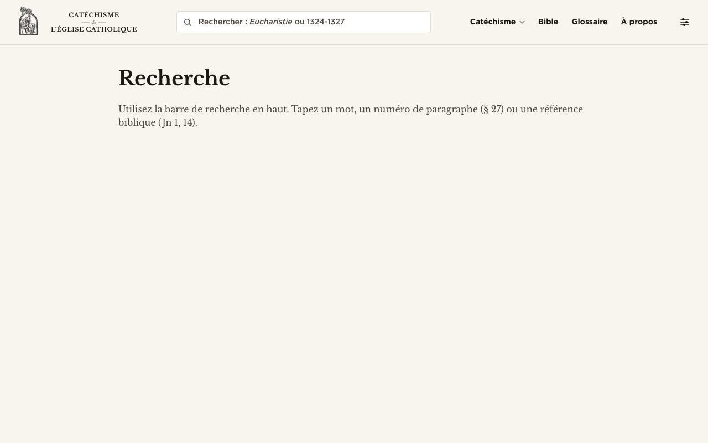
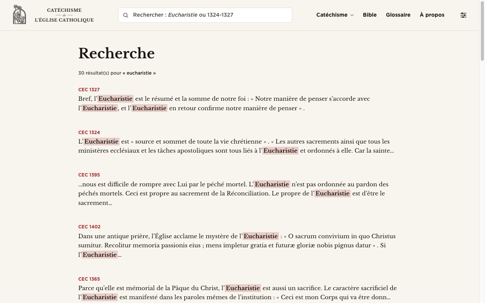
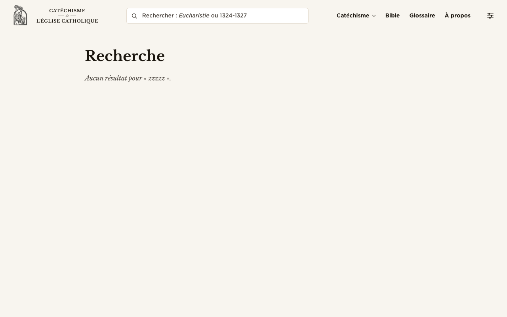
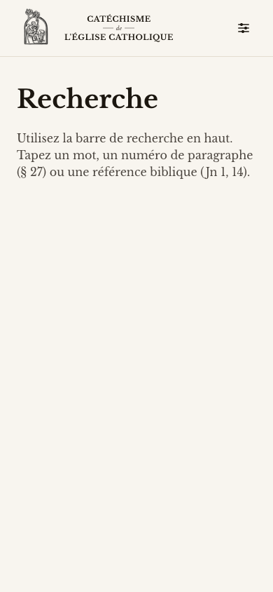
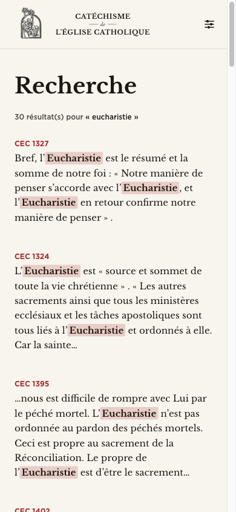
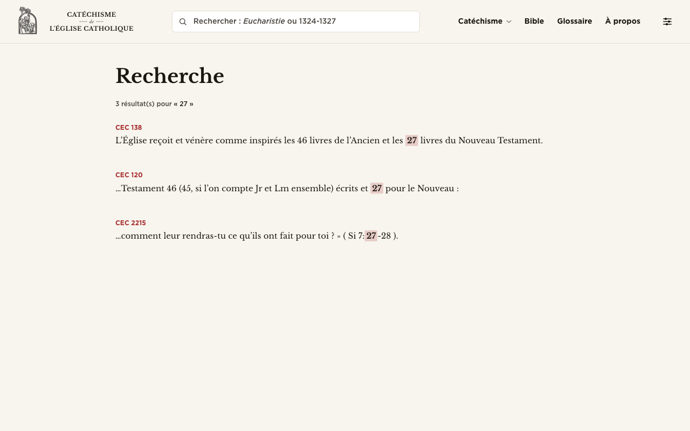
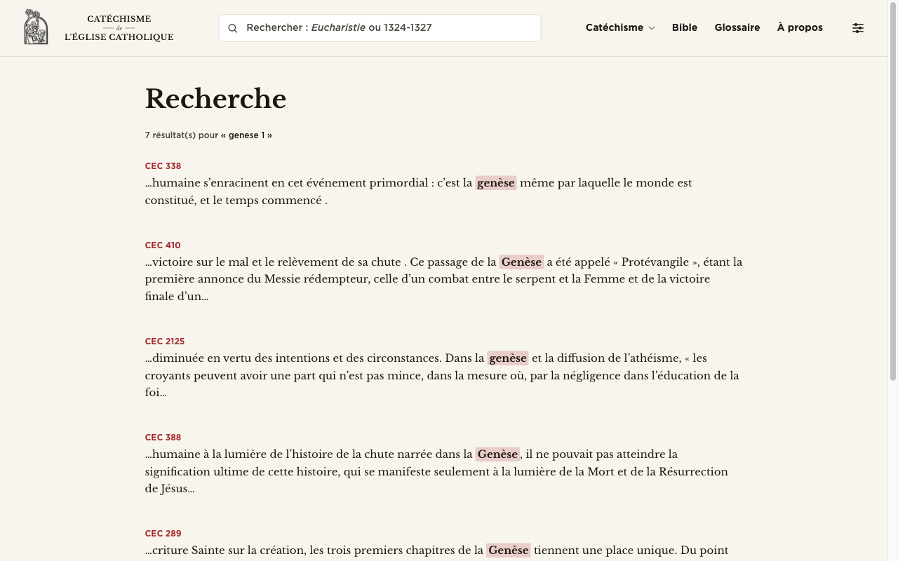

# Search page — design review

Date: 2026-05-05
Routes: `/recherche`, `/recherche?q=…`
Source: `src/routes/recherche/+page.svelte`, `src/routes/recherche/+page.ts`, `src/routes/api/search/+server.ts`, `src/lib/utils/searchIntent.ts`, `src/lib/components/ui/TopBar.svelte`

## TL;DR

- **The page has no search input of its own** — it tells users to "use the bar at the top," and on mobile that bar isn't even rendered (the global header search is `hidden lg:block`). Land on `/recherche` from a phone and the page is a dead end.
- **The empty state offers nothing** — no example queries, no recent searches, no popular terms, no "browse instead" affordances. A first-time visitor has no idea what's actually searchable (the index is CCC paragraphs + headings only — Bible and Glossaire are not indexed).
- **Result cards under-perform** — every result is just a CCC reference + snippet, with no visual distinction for paragraph vs. heading hits, no part/chapter context, no breadcrumb, and identical sparse spacing for 30 items. Long lists become a wall of barely-distinguishable rows.

## Inventory — what's there now

The page consists of:

1. The shared `TopBar` (which on `lg+` viewports contains the only search input).
2. An `<h1>Recherche</h1>` heading in Libre Baskerville.
3. One of three states:
   - **Empty** (no `?q`): one paragraph of muted body text instructing the user to "use the search bar at the top."
   - **Zero results**: an italic muted line "Aucun résultat pour « … »."
   - **Results**: a `Nn résultat(s) pour « q »` count line, then a `<ul>` with up to 30 hits. Each hit is a clickable `<a>` block showing a small accent-coloured eyebrow (`CEC 1327` or `Titre · CEC 1324`) and a 220-char body snippet with `<mark>`-style highlights on matched terms.

Search backend: MiniSearch index in Cloudflare KV, scope = CCC paragraphs and chapter/section headings. Phrase-boost re-ranks. 30-result cap. Highlighting and best-window snippeting are handled client-side from raw text. `searchIntent.ts` exists but runs only inside the `TopBar` form's submit handler — the `/recherche` page itself never invokes intent detection.



## Empty state

**Currently** a single muted sentence sits 60px below the H1. The instruction even points users to a search bar that may not exist on their viewport.

**Issues:**

1. *No on-page input.* If you navigate here from a mobile bookmark or a shared link, the page is unusable — there is no way to enter a query without going back to the homepage.
2. *Wasted opportunity.* The page is the canonical entry point for all search; it should surface the catechism's structure: 4 parts, 2865 paragraphs, chapter and section headings.
3. *Misleading scope hint.* The copy mentions "référence biblique (Jn 1, 14)" but typing `Jn 1,14` here doesn't open the Bible reader — it does a *text* search in the CCC. Intent-routing only fires from the `TopBar` form. So the hint promises behaviour the page doesn't deliver.

**Proposed direction (editorial register):**

- **Hairline-bordered search field** as the page's centerpiece — same hairline language as the chapter filter and Bible-reader switch you already use elsewhere. Place it directly under the H1 with generous vertical room. Auto-focus on mount. Submit goes through the same `detectIntent` pipeline as the global bar so a user typing `27` here ends up on `/ccc/27`, exactly as expected.
- **Three "examples" rows** under the field, presented as leader-dot rows (matching the glossary A-Z aesthetic):
  - *Par mot* …………… *trinité* · *eucharistie* · *grâce*
  - *Par paragraphe* … *§ 27* · *§ 1324–1327*
  - *Par référence biblique* … *Jn 1, 14* · *Gn 1, 1*
  Each example is a real link that performs the search — instructional and clickable in one move.
- **"Récemment consulté"** row pulled from `localStorage` (last 5 queries, dismissable). Skip if the list is empty — never show an empty section.
- **A small "Parcourir le Catéchisme" footer** with three discreet links: *Sommaire* · *Prologue* · *Glossaire*. Gives users an escape hatch when they don't have a query in mind.

Tone register: keep the voice of the rest of the site — small caps headings, italic example terms, hairline rules. No card chrome, no rounded "popular searches" pills. Think Oxford reference index, not SaaS dashboard.

## Search input

**Currently:** the only search input is in `TopBar`, capped at `max-w-[460px]`, hidden below `lg`. Inside the input, a custom overlay placeholder reads "Rechercher : *Eucharistie* ou 1324-1327" with the keyword in italics. Focus ring is a thin border-coloured ring; no clear-input affordance; no visible keyboard shortcut hint.

**Issues:**

1. *Mobile invisibility.* `hidden lg:block` is the show-stopper. The site has no mobile search UI at all on this page (no hamburger search either, based on the markup).
2. *Single point of failure.* If the global bar fails to render or is hidden, the site has zero search affordance. The `/recherche` page should always own a fallback input regardless of viewport.
3. *No clear button.* Once typed, users can only erase character-by-character or use the native browser `×` (which appears inside the input but is browser-styled and not consistent across UAs).
4. *No keyboard hint.* For a research tool, a `⌘K` / `Ctrl K` overlay would be expected and reinforces that this is a serious reference site.
5. *The page H1 "Recherche" is redundant once the input is on-page.* If you put the input directly on `/recherche`, the H1 is decorative — keep it but consider compressing the spacing, or replace with a smaller eyebrow ("La recherche du Catéchisme") and let the input itself be the headline.

**Proposed direction:**

- **Page-owned input:** large, centered, full-width up to `max-w-[640px]`. Libre Baskerville italic placeholder, hairline bottom border (no rounded box on this canonical page — the same restrained switch language as the chapter filter). Focus state: thicken the underline to 1.5px in accent. No left search icon — let the placeholder do the work.
- **Trailing affordances when filled:** hairline `Effacer` text-link on the right, `↵` glyph in muted color to hint at submit. Both vanish when the input is empty.
- **Hide the global header search on `/recherche`** so there is one obvious input. Do show it on every other page.
- **Keyboard:** keep `/` or `⌘K` focusing it from anywhere on the page. Show the shortcut in the placeholder area (e.g., a hairline `/` chip on the right edge).
- **Form action goes through `detectIntent`.** Typing `27` here should route to `/ccc/27`. Typing `Jn 1, 14` should route to `/bible/jean/1/14`. The empty-state copy already promises this — make it true on this page too.

## Result cards

**Currently** each hit is a flat `<li>` with two stacked text rows:

- Eyebrow: `CEC 1327` (paragraphs) or `Titre · CEC 1324` (headings) — accent red, 12px, semibold, tabular numerals.
- Body: 15px serif snippet, line-height 1.625, with `<mark>` highlights tinted in 20%-opacity accent.

The wrapper is `<a class="block hover:bg-accent/5 p-3 -mx-3 rounded">`, which gives a subtle warm-tinted hover plate.

**Issues:**

1. *No part/chapter context.* "CEC 1327" is meaningless without telling the reader where 1327 lives ("Partie II · Section II · L'Eucharistie"). Searches are exploratory; users need orientation, not just a number.
2. *Heading-vs-paragraph ambiguity.* The eyebrow tries to disambiguate ("Titre · CEC 1324"), but it reads as a typographic afterthought — the visual weight of a heading hit is identical to a paragraph hit. Consider rendering heading hits as a slightly different row treatment (e.g., a small uppercase eyebrow "TITRE DE SECTION" plus the heading text *as the main line* with no snippet, since the heading text is itself the match).
3. *Snippet-window can hide the matched term.* The "best snippet" picks the densest 220-char window, which for paragraphs with one match near the end can result in a snippet whose only occurrence of the term is at the very edge — pushed in or out by ellipsis. Verify visually with `q=trinité`: in some cards the term is barely visible.
4. *Highlight color reads as a yellowed sticky-note.* On the cream background, 20%-accent-on-cream has a tea-stained quality that fits the editorial mood, but the *bolding* of highlighted text alongside the tint is a bit much for an editorial register. Consider underline-on-accent or just background-tint, not both. The bold makes pages full of matches feel jittery.
5. *No "view in context" affordance.* The hit links straight to `/ccc/{n}`, which is correct but offers no preview of *what part of the catechism* it lands the user in. A small tertiary line under the snippet — something like *Partie II · La célébration du mystère chrétien · L'Eucharistie* — would convert clicks-to-context into a single visual scan.
6. *No score / no sense of relevance.* For 30 results the rank order matters and is invisible. A single hairline divider after the top-3 (or "top results" label) would help users feel the relevance falloff.
7. *Hover plate.* The `accent/5` background-tint plus `-mx-3` overhang draws a card around the row that feels web-app-y. The rest of the site favors hairline rules, not tinted plates. Consider replacing with a left-edge accent-bar on hover (1px) and underline on the eyebrow.



**Proposed result-card structure:**

```
[ small eyebrow: section/chapter trail ]   [ optional small tag: TITRE / § ]
Headline-or-snippet line in Baskerville 16px
trailing breadcrumb Libre Franklin 11px small-caps muted
hairline rule below
```

Density: 16-20px vertical breathing room between rows, plus a hairline separator. Mirror the glossary list rhythm.

## Result grouping / filters

**Currently** the index covers only CCC content (paragraphs and headings). There are no filters and no grouping — results stream in score order, paragraphs and headings interleaved.

**Issues:**

1. *Heading hits get drowned.* A heading match is conceptually higher-information ("the user matched a section title"), but BM25 scoring on a short heading often loses to a long paragraph that has the term twice. Even with `boost: { title: 2 }`, the visual treatment doesn't communicate that a heading hit is a "this section is about your topic" signal.
2. *No type filter.* Users searching `eucharistie` get 30 paragraph hits when sometimes what they want is "show me the section devoted to the Eucharist." A simple two-tab segmented control above the results — *Tout · Sections · Paragraphes* — would be discreet and useful.
3. *No part filter.* The CCC has 4 parts; sometimes users only want results in Part III (life in Christ). A dropdown is overkill, but a row of 4 small text-links would mirror the catechism mega-menu's structure and give users a fast filter.
4. *No Bible / Glossaire scope.* This is a strategic question for the user, not just visual. The empty-state copy promises Bible-ref handling, but only via intent-routing. Should there be cross-source results — top CCC hits *and* a small "Voir dans le Glossaire" / "Voir dans la Bible" affordance? At minimum, when a query matches a glossary term exactly, surface a single banner-row "Glossaire : *Eucharistie* →" above the CCC hits. Cheap to implement (the glossary index is already on the client) and editorially appropriate.

**Proposed direction:**

- **Section banner (when applicable):** if the query matches a heading exactly or a glossary term exactly, render one promoted row at the very top with a different eyebrow ("Section du Catéchisme" or "Glossaire"). Treat this as the "definition card" — short, bold, signed-off with a small `→`. Below, a hairline rule and *Autres résultats* eyebrow.
- **Two-tab segmented filter:** *Tout (30) · Sections (4) · Paragraphes (26)*. Use plain underlined text-buttons with tabular numerals, not pill buttons.
- **No part facets at launch** — defer until usage data shows it's needed. Keep the page calm.

## Density & rhythm

**Currently** results have `space-y-5` between `<li>` items (20px), each item has `p-3` internal padding (12px), and the hover plate adds visual weight. There are no dividers, no top-of-list label beyond the count, and no end-of-list footer.

**Issues:**

1. *Sparseness without rhythm.* 30 cards stacked with identical spacing become a wall. Without dividers or any kind of meta-marker (top-3, by-section grouping), the eye glazes.
2. *No "end of results" affordance.* The 30-cap is silent. A small italic "Affichage des 30 meilleurs résultats — affinez votre recherche pour en voir plus" closer would set expectations and fits the register.
3. *Top of page is sparse.* The H1 sits alone with the count beneath it. Once the on-page input lands here, this real estate fills naturally, but right now `pt-10` is a lot of dead air.
4. *Reading width.* `max-w-reader` is the same constraint as long-form reading; for a results list, that may be slightly wide. Consider `max-w-[60rem]` for the results region so eyebrows and breadcrumbs don't span as far.

**Proposed direction:**

- Hairline rule between rows (1px `border-t border-border/50`) instead of background-tint hover plates.
- Slightly tighter row padding (8px y) but more between-row space (24px) to give each result its own pause.
- Group label for top-3 results visually, e.g., a single `Plus pertinents` eyebrow, hairline below, then `Autres résultats` for the rest. Mirror this with a closer label "30 résultats. Affinez la recherche pour préciser."
- If keeping the count line, render it in small-caps Libre Franklin and align it with the eyebrows (left edge), not centered or floated. Currently it is left-aligned but visually disconnected from the result list.

## Zero results

**Currently** "Aucun résultat pour « zzzzz »." in italic muted serif. That's the entire screen. Below the fold is empty cream.



**Issues:**

1. *Zero-help.* No suggestions, no fallback, no "did you mean," no offer to browse instead.
2. *No diacritic guidance.* The tokenizer strips diacritics so `eglise` matches `Église`, but a user who knows their query is unusual may not know that. A small note "Les accents sont ignorés" would help.
3. *Still no input on this state.* Same dead-end issue as empty state — there's no way to fix the typo in place.

**Proposed direction:**

- Keep the line "Aucun résultat pour « zzzzz »." but follow it with:
  - **Suggestions** based on Levenshtein-1 / first-3-chars stemming against the index vocabulary. *"Vouliez-vous dire …"* with up to 3 candidate terms as text-links. (Cheap to compute client-side from the loaded index dictionary.)
  - **Fallback offer**: *"Parcourir le Glossaire pour ce terme"* and *"Voir le Sommaire du Catéchisme"* as two hairline text-links.
  - **Diacritic / spelling note** in small muted text: *"Les accents et les œ/oe sont ignorés ; les recherches de moins de 2 caractères ne sont pas effectuées."*

## Mobile

**Currently** at 390px the page is non-functional in the empty state. The header collapses to logo + mode toggle + a small icon menu (settings glyph), with no search input and no obvious entry to one. The empty-state instruction "Use the bar at the top" is therefore false on mobile.




**Issues:**

1. *No search affordance at all on mobile* — not on the recherche page, not in the global header (`hidden lg:block`). Even the `lg`-hidden state doesn't substitute a sheet/modal trigger.
2. *Result rows are legible* — the type stack scales well, snippet wraps cleanly. Mobile content layout itself isn't the problem.
3. *Snippet truncation on mobile* — the `…ellipsis` prefix can land mid-word visually; verify against narrower break points.

**Proposed direction:**

- **First and most important:** the on-page input (recommended for desktop above) solves mobile too. Make it the first interactive element on the page.
- **Globally:** add a search-icon button to the mobile header that opens an overlay/sheet with the same input + intent detection. Tracked separately from this review, but blocks the recherche page being usable on mobile.
- **Sticky on mobile:** when results scroll past, sticky the input to the top of the viewport so users can refine without scrolling back up.

## Loading / perceived performance

**Currently** SvelteKit's `+page.ts` `load` function awaits `/api/search?q=…` and only renders results once the JSON returns. There is no loading state, no skeleton, no spinner — the user clicks a result on `/recherche?q=foo`, navigates, hits back, and the list flashes back in roughly synchronously (cached). On a fresh query, the request is ~50–200ms locally but could be slower on Cloudflare cold-start.

**Issues:**

1. *No loading shimmer.* On a slow connection, the results count and list render together at the end. The H1 is already there but there's no progress indicator. This is fine for fast networks, suboptimal for cellular.
2. *No instant-search.* Users type, hit return, the page navigates, the load runs, results appear. There's no in-place type-ahead. For a reference site this is defensible (the URL is shareable, the round-trip is short), but a *type-ahead overlay in the global header* would be a separate, complementary feature — out of scope for this page review but worth flagging as the natural next step.
3. *Phrase-boost rerun on every request.* Server-side rerank runs phrase-boost for every query; for caching purposes consider whether the SvelteKit `load` could memoize identical queries during a session.

**Proposed direction (page-scoped):**

- Add a 6-row skeleton (hairline rules + grey 1-line placeholders) that renders while `data.hits` is loading. Use a streamed response or a client-side `fetch` after the page mounts so the skeleton has time to show.
- After form submit, render an immediate optimistic state — H1, the typed query echoed in the count line "Recherche en cours pour « … »" — before the actual response lands.
- Show a tiny `tabular-nums` timing badge in dev only ("48 ms"), not in production.

## Numeric / reference query intent surprise

A separate observation worth promoting from the body: typing `27` directly into `/recherche?q=27` returns three text matches against paragraphs that contain "27" as a number string (CEC 138, 120, 2215). This is genuinely useful for some queries (cross-references) but contradicts user intent when the typed `27` was meant as "open paragraph 27." The global `TopBar` does run intent-detection and would route `27` to `/ccc/27`. The page itself doesn't.




**Recommendation:** in the page's `+page.ts` `load`, run `detectIntent(q)` server-side and `redirect(303, intent.href)` if the kind is `paragraph` or `bible`. This unifies behavior between the header bar and the page and makes shared/bookmarked URLs that contain a numeric query do the right thing. (Bonus: shareable links like `/recherche?q=Jn%201,14` route correctly.)

## What's working — leave alone

- **Highlighting code is solid.** The `foldedWords` / `bestSnippet` / `highlight` trio handles French diacritics and `œ` ligatures correctly without index/text drift. This is the kind of detail that screams editorial seriousness.
- **Phrase boost.** Promoting literal phrase matches above BM25-bag-of-words rankings is the right call for a doctrinal corpus where exact phrasings matter.
- **Eyebrow typography.** `font-ui text-xs text-accent font-semibold tabular-nums` hits the right register — small-caps-ish, restrained, classical.
- **`<mark>` styling.** The 20%-opacity accent tint is on-brand. Consider dropping the `font-weight: 600` paired with it (see Result Cards #4), but the color and rounded-2px treatment are aesthetically right.
- **30-result cap.** Keeps the page from being a firehose; pairs well with the planned "refine your search" closer.
- **URL state.** `?q=` is queryable, shareable, and survives reloads. Don't break this with any client-side state-only refactor.
- **Title in `<svelte:head>`.** Clipping the query at 80 chars in the `<title>` is a thoughtful detail.

---

*Out of scope for this review:* the global `TopBar` search input redesign (touched lightly under "Search input" but its own work item), the addition of a mobile search affordance to the global header, expansion of the search index to include Bible verses or glossary entries, type-ahead overlay UX. These are referenced where they intersect with the page critique but each warrants its own brief.
